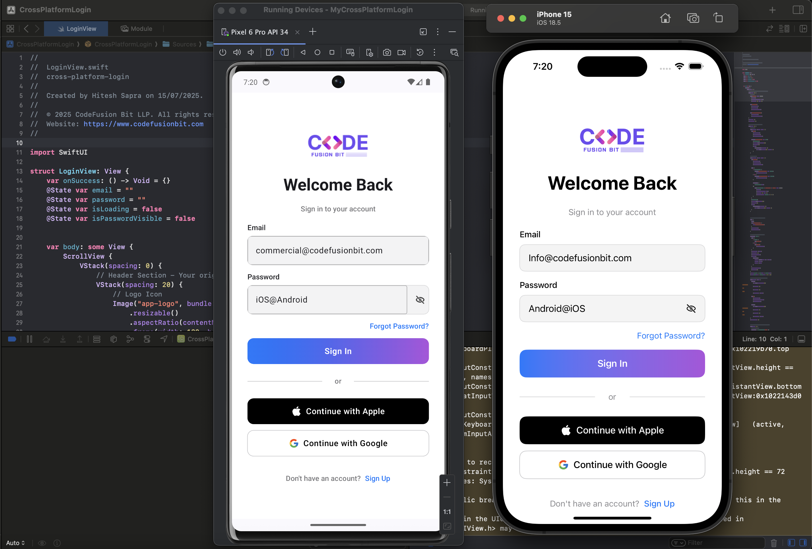

# CrossPlatformLogin

A beautiful, fully native cross-platform login application built with Swift and SwiftUI that runs on both iOS and Android using Skip framework.

## 🚀 Project Overview

**CrossPlatformLogin** demonstrates the power of writing Swift code once and deploying it natively on both iOS and Android platforms. The app features a modern, polished login interface with social authentication options, built using SwiftUI for iOS and automatically transpiled to Jetpack Compose for Android via Skip.

[](LICENSE)

<a href="https://codefusionbit.com/" target="_blank" rel="noopener noreferrer">
  
</a>

## Screenshot 🖼️
<div align="center">
  <!-- Mobile Screenshots -->
  <div style="margin-bottom: 20px;">
    
  </div>
</div>

### ✨ Key Features

- **🎨 Beautiful UI Design** - Modern, consistent design across platforms
- **📱 Native Performance** - True native performance on both iOS and Android
- **🔐 Authentication System** - Email/password and social login options
- **⚡ Real-time Validation** - Form validation and loading states
- **🌓 Theme Support** - Light/dark mode compatibility
- **📊 Data Management** - CRUD operations with local persistence

## 🏗️ Architecture

### Tech Stack
- **Language**: Swift 5.9+
- **UI Framework**: SwiftUI (iOS) → Jetpack Compose (Android via Skip)
- **Cross-Platform**: Skip Framework
- **State Management**: SwiftUI @State, @Observable
- **Navigation**: NavigationStack with routing
- **Data Persistence**: JSON file storage

### Project Structure
```
CrossPlatformLogin/
├── Sources/
│   └── CrossPlatformLogin/
│       ├── CrossPlatformLoginApp.swift    # Main app entry point
│       ├── RootViewRouter.swift           # Navigation routing
│       ├── LoginView.swift                # Authentication UI
│       ├── ContentView.swift              # Main app content
│       └── ViewModel.swift                # Data management
├── Tests/
├── Package.swift                          # Swift Package configuration
└── README.md
```

## 🛠️ Prerequisites

Before getting started, ensure you have:

- **macOS 14+** with Xcode 16
- **Android Studio 2025** (for Android development)
- **Homebrew** package manager
- **Android Emulator** configured and running

## ⚙️ Installation & Setup

### 1. Install Skip Framework
```bash
# Install Skip CLI via Homebrew (Recommended)
brew install skiptools/skip/skip

# Alternative: Direct installation (if Homebrew not available)
curl -L https://source.skip.tools/install.sh | bash

# Upgrade to latest version
skip upgrade

# Install Android SDK tools
skip android sdk install

# Verify installation (may take time on first run)
skip checkup --native

# Check Skip version
skip --version
```

### 2. Create New Project (Optional - for new projects)
```bash
# Create a new Skip cross-platform project
skip init --native-app --open-xcode --appid=com.yourcompany.CrossPlatformLogin cross-platform-login CrossPlatformLogin

# This command will:
# - Create project structure
# - Configure iOS and Android targets  
# - Set up Skip transpilation
# - Automatically open in Xcode
```

### 3. Clone & Setup Existing Project
```bash
# Clone the repository
git clone https://github.com/codefusionbitllp/cross-platform-login.git
cd CrossPlatformLogin

# Resolve Swift package dependencies
swift package resolve

# Open in Xcode
open CrossPlatformLogin.xcworkspace
```

## 🚀 Running the Application

### Development Mode
1. **Start Android Emulator** via Android Studio
2. **Open Xcode** and select iOS simulator target
3. **Build & Run** (`Cmd+R`) - App launches on both platforms simultaneously!

### Platform-Specific Testing
```bash
# iOS only (Xcode)
- Select iOS Simulator target
- Press Cmd+R

# Android only (Skip)
skip android run

# Both platforms
skip run --all-platforms
```

## 📦 Build & Export

### iOS Build
```bash
# Debug build
xcodebuild -scheme CrossPlatformLogin -configuration Debug

# Release build for App Store
xcodebuild -scheme CrossPlatformLogin -configuration Release archive

# Export IPA for distribution
xcodebuild -exportArchive -archivePath "CrossPlatformLogin.xcarchive" -exportPath "Export/" -exportOptionsPlist "ExportOptions.plist"
```

### Android Build
```bash
# Debug APK
skip android build --debug

# Release APK
skip android build --release

# Android App Bundle (for Play Store)
skip android bundle --release
```

### Skip Export Commands
```bash
# Export for iOS App Store
skip export ios --release

# Export for Google Play Store  
skip export android --release

# Export both platforms
skip export --all-platforms --release

# Export with specific configurations
skip export ios --configuration Release --destination "Export/iOS/"
skip export android --configuration Release --destination "Export/Android/"
```

### Export Locations
- **iOS Archive**: `Build/Products/Release-iphoneos/`
- **iOS IPA**: `Export/iOS/`
- **Android APK**: `Android/app/build/outputs/apk/`
- **Android Bundle**: `Android/app/build/outputs/bundle/`
- **Skip Exports**: `Export/` directory

## 🔐 Authentication System

### Demo Credentials
For testing purposes, use:
- **Email**: `demo@example.com` or any valid email format
- **Password**: `password123` or any password (6+ characters)

### Authentication Flow
```swift
// Email validation
email.contains("@") && email.contains(".")

// Password validation  
password.count >= 6

// Social login simulation
handleSocialLogin("Apple" | "Google")
```

### Security Features
- Input validation and sanitization
- Secure field for password entry
- Loading states during authentication
- Error handling for invalid credentials

## 📁 Directory Structure

```
CrossPlatformLogin/
├── 📱 Sources/CrossPlatformLogin/
│   ├── 🎯 CrossPlatformLoginApp.swift     # App delegate & lifecycle
│   ├── 🧭 RootViewRouter.swift            # Navigation & routing logic
│   ├── 🔐 LoginView.swift                 # Authentication interface
│   ├── 📋 ContentView.swift               # Main app content (tabs)
│   └── 💾 ViewModel.swift                 # Data models & persistence
├── 🧪 Tests/CrossPlatformLoginTests/
├── 📦 Package.swift                       # Dependencies & configuration
├── 🎨 Resources/                          # Images, icons, assets
└── 📚 Documentation/
```

## 🎨 UI Components

### Custom Components
- **LoginView** - Beautiful authentication interface
- **SocialLoginButton** - Reusable social auth buttons
- **PlatformHeartView** - Cross-platform component demo
- **ItemListView** - CRUD operations with SwiftUI List

### Design System
- **Colors**: Primary blue, accent purple/pink gradients
- **Typography**: SF Pro (iOS), Roboto (Android)
- **Spacing**: Consistent 8px grid system
- **Corner Radius**: 10px fields, 12px buttons

## 🏢 Company Information

**© 2025 CodeFusion Bit LLP. All rights reserved.**

- **Website**: [https://www.codefusionbit.com](https://www.codefusionbit.com)
- **Contact**: [info@codefusionbit.com](mailto:info@codefusionbit.com)
- **Specialization**: Cross-platform mobile app development
- **Technologies**: Swift, SwiftUI, Skip Framework, Flutter, TypeScript, Next.js, Django, and cross-platform development for iOS & Android.
- **Technical Project Manager / Team Lead / Developer**: Hitesh Sapra ([@saprahits](https://hiteshsapra.com))

### About CodeFusion Bit
CodeFusion Bit LLP is a leading mobile app development company specializing in innovative cross-platform solutions. We leverage cutting-edge technologies like Skip Framework to deliver truly native experiences across iOS and Android platforms from a single Swift codebase.

## 📋 Development Notes

### Platform-Specific Considerations
```swift
// Platform detection
#if os(Android)
    // Android-specific code
#else
    // iOS-specific code  
#endif

// Custom extensions for cross-platform compatibility
extension View {
    func platformPadding() -> some View {
        // Different padding for iOS vs Android
    }
}
```

### Skip Framework Benefits
- ✅ **Single Codebase** - Write Swift, run everywhere
- ✅ **Native Performance** - No bridge overhead
- ✅ **Native UI** - SwiftUI → Jetpack Compose
- ✅ **Hot Reload** - Fast development iteration
- ✅ **Package Ecosystem** - Access to Swift packages

## 📚 Documentation & Resources

### Official Skip Documentation
- **Main Documentation**: [https://skip.tools/docs](https://skip.tools/docs)
  **SwiftUI Support**: [https://skip.tools/docs/modules/skip-ui/](https://skip.tools/docs/modules/skip-ui/)
- **GitHub Repository**: [https://github.com/skiptools/skip](https://github.com/skiptools/skip)

### Helpful Links
- **Skip Community**: [https://community.skip.tools](https://community.skip.tools)
- **Skip Slack**: [https://skip.tools/slack](https://skip.tools/slack)
- **Example Projects**: [https://github.com/skiptools](https://github.com/skiptools)
- **Release Notes**: [https://github.com/skiptools/skip-ui/releases](https://github.com/skiptools/skip-ui/releases)

## 🤝 Contributing & Acknowledgments

1. **Fork** the repository
2. **Create** feature branch (`git checkout -b feature/amazing-feature`)
3. **Commit** changes (`git commit -m 'Add amazing feature'`)
4. **Push** to branch (`git push origin feature/amazing-feature`)
5. **Open** Pull Request

## License

This project is licensed under the MIT License - see the LICENSE.md file for details

**Built with ❤️ by CodeFusion Bit LLP using Swift & Skip Framework**